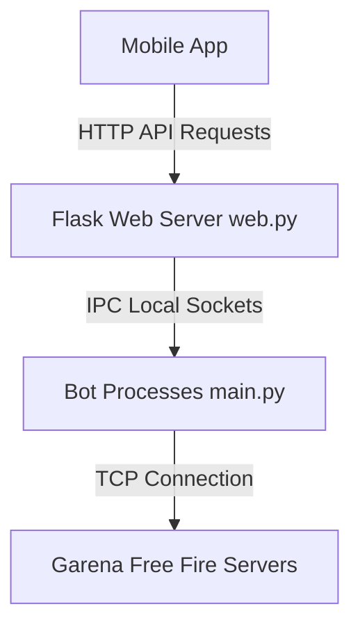

# Free Fire Bot Server - API Documentation & Integration Guide

This guide describes how the bot server backend (`web.py`) works, how it manages background bots, and how to integrate it with your mobile application.

---

## How It Works Under the Hood

The server acts as a coordinator between your frontend application and Garena Free Fire TCP servers:



1. **Web Server (`web.py`)**: A Flask web application that serves API endpoints and runs a background monitor thread (`bot_monitor_loop`) to auto-start and keep up to `MAX_BOT_LIMIT` bots running.
2. **Bot Process (`main.py`)**: Individual background processes spawned for each bot. They establish TCP connections with Garena's online and chat servers.
3. **IPC (Inter-Process Communication)**: Each bot opens a local TCP socket. When the web server receives an API command, it forwards it to the bot over the IPC port, and returns the bot's response back as an HTTP JSON response.

---

## Base URL
Default Local URL: `http://127.0.0.1:5000`

---

## API Endpoints Reference

### 1. Get Bot Status
Retrieve the real-time online/offline status, PIDs, and names of all bots configured in `bot.txt`.

* **Endpoint**: `/api/bots_status`
* **Method**: `GET`
* **Response**:
```json
{
  "summary": {
    "total": 10,
    "online": 2,
    "offline": 8
  },
  "bots": [
    {
      "uid": "4310576482",
      "name": "SPTCPBOT",
      "status": "Online",
      "pid": 5904
    },
    {
      "uid": "4059573407",
      "name": "RON-⚡-00002",
      "status": "Online",
      "pid": 18712
    },
    {
      "uid": "4059587407",
      "name": "Offline",
      "status": "Offline",
      "pid": null
    }
  ]
}
```

---

### 2. Create Squad (Lobby Generator)
Commands the first active bot to open a lobby squad in Garena Free Fire. The bot intercepts Garena's response packet containing the team code and returns it.

* **Endpoint**: `/api/create_squad`
* **Method**: `POST`
* **Headers**: `Content-Type: application/json`
* **Response (Success)**:
```json
{
  "status": "success",
  "team_code": "489201",
  "bot_uid": "4310576482"
}
```
* **Response (Error)**:
```json
{
  "status": "error",
  "message": "No active bots connected"
}
```

---

### 3. Group Exploit Trigger
Initiates the ghost group/lobby exploit sequence targeting a specific player UID.

* **Endpoint**: `/api/group_exploit`
* **Method**: `POST`
* **Headers**: `Content-Type: application/json`
* **Request Body**:
```json
{
  "uid": "13968219918",
  "slot": 5
}
```
* **Response**:
```json
{
  "status": "success",
  "message": "Exploit sequence initiated."
}
```

---

### 4. Send Custom Bot Command
Sends direct commands (Invite, Like, Kick, Ban Check, etc.) to the active bot.

* **Endpoint**: `/api/send_bot_command`
* **Method**: `POST`
* **Headers**: `Content-Type: application/json`
* **Request Body**:
```json
{
  "type": "invite", 
  "payload": "13968219918"
}
```
*Supported Types*:
- `"invite"` (Payload: Player UID to invite)
- `"like"` (Payload: Player UID to send lobby likes)
- `"kick"` (Payload: Player UID to kick from team lobby)
- `"check_ban"` (Payload: Player UID to inspect ban status)
- `"room_msg"` (Payload: Message text to send to room lobby chat)

* **Response**:
```json
{
  "status": "success",
  "message": "Invite sent successfully"
}
```

---

### 5. Fetch Account Credentials
Retrieve list of all accounts stored inside `bot.txt`.

* **Endpoint**: `/api/accounts`
* **Method**: `GET`
* **Response**:
```json
[
  {
    "uid": "4310576482",
    "password": "E035DBE9AD93983E9EFC8C099C586468BE79D28BFAF56E28F19815AD36B47D2C"
  }
]
```

---

### 6. Save Account Credentials
Add new bot accounts or update passwords inside `bot.txt`.

* **Endpoint**: `/api/save_group`
* **Method**: `POST`
* **Headers**: `Content-Type: application/json`
* **Request Body**:
```json
{
  "accounts": [
    {
      "uid": "4310576482",
      "password": "E035DBE9AD93983E9EFC8C099C586468BE79D28BFAF56E28F19815AD36B47D2C"
    }
  ]
}
```
* **Response**:
```json
{
  "status": "success",
  "message": "1 accounts saved to bot.txt"
}
```

---

### 7. Get Server Logs
Get current running terminal outputs from the bot server.

* **Endpoint**: `/api/get_all_logs`
* **Method**: `GET`
* **Response**: A JSON array containing the last 500 lines of execution logs.

---

### 8. App Version Check
Check if a new app version update is available.

* **Endpoint**: `/api/version`
* **Method**: `GET`
* **Response**:
```json
{
  "status": "success",
  "version": "1.1",
  "update_required": false,
  "message": "You are running the latest version of the app."
}
```
